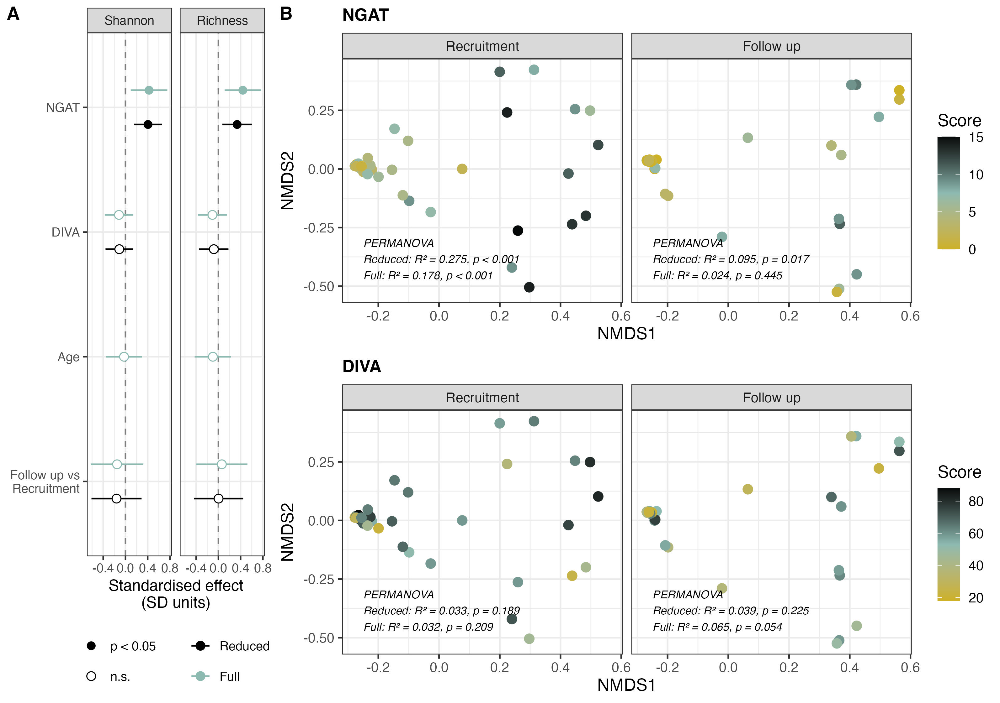

# A clinician-assessed measure of vaginal epithelial health is associated with multiomic signatures in genitourinary syndrome of menopause
Github author: Lauren Mee

[](https://doi.org/10.5281/zenodo.23242060)



Analysis pipeline linking 16S rRNA microbiome and NMR metabolome data to two clinical measures of vaginal atrophy severity — **NGAT** (clinician-scored) and **DIVA** (patient-reported) — in a cohort of post-menopausal women with GSM. Control patients were included for descriptive comparisons.
Manuscript in process of being submitted and this README will be updated with DOI and authorship details once available.

## QuickStart Guide

Note that input, processed or output files that exceed 100MB are not stored in this repository in accordance with Github file size limitations and must be regenerated by the pipeline.

### Requirements

- **R >= 4.4** (developed on 4.5.2)
- ~4 GB RAM, ~3 GB free disk
- Dependencies (covered in script 00)

### Input

Available input here includes the pre-normalised NMR spectra data (`input/nmr/VANS_tampons_master_data_matrix_updated_Sep2024_missing_values_replaced.csv`) and patient metadata given by sample (`input/SampleMetadata.csv`).

Please note that this pipeline also requires **trimmed** FASTQ forward read files (source: [PRJEB127961](https://www.ebi.ac.uk/ena/browser/view/PRJEB127961), see manuscript for trimming parameters) and SILVA SSU training sets ([McLaren, M. R., & Callahan, B. J. (2021)](https://doi.org/10.5281/zenodo.4587955)). 
The pipeline will expect the following file naming conventions and input architecture:

```
input/
├── microbiome/
│   ├── trimmed/                         # primer-trimmed FASTQ (forward reads only)
|      ├── VAN[\d+]_R1_Trimmed.fastq.gz
│   ├── taxaDB/                          # SILVA v138.1 train set + species assignment
|      ├──  silva_nr99_v138.1_train_set.fa
|      ├──  silva_species_assignment_v138.1.fa
```

### Running analysis

Scripts **must be run in order** — each consumes checkpoint files written by the
previous ones. All scripts assume the **project root** as the working directory.

```r
# from the project root, in this order
source("scripts/00_Install.R")           # installs all dependencies. Required for all downstream
source("scripts/01_Micro_Processing.R")  # microbiome: DADA2 + taxonomy assignment. Required to run 02, 04
source("scripts/02_Micro_Analysis.R")    # microbiome: analysis
source("scripts/03_NMR_Analysis.R")      # metabolomic: analysis. Required to run 04
source("scripts/04_NetworkBuild.R")      # integration: building networks. Required to run 05.
source("scripts/05_NetworkComparison.R") # integration: assessing networks
source("scripts/06_FinalCohortCheck.R")  # final checks: looking at demography of analysis subcohorts
```

Note: Scripts 03 does not depend directly on script 02 and can be run in parallel with it if desired.

#### Breakdown

- `00_Install.R`: uses `BiocManager` to install packages needed to run the pipeline. Any failed installations are printed to screen.

- `01_Micro_Processing.R`: Turns trimmed 16S reads into ASVs with DADA2 and assigns SILVA taxonomy. Removes likely reagent contaminants, low-read samples and patients without both visits. Main outputs: `phyloseq` objects at ASV, genus and phylum level for further analysis (script 02) and draws a community-composition plot (manuscript figure).

- `02_Micro_Analysis.R`: Computes alpha diversity (Shannon, richness) by rarefaction and models it against NGAT/DIVA with mixed models. Runs beta diversity (Bray-Curtis and robust Aitchison NMDS plus PERMANOVA) separately at each visit. Finally tests _Lactobacillus_ abundance and per-genus associations (MaAsLin3) against severity scores. Main outputs: LMM/`MaAsLin3` results, plots alpha/beta and _Lactobacillus_ outputs (manuscript figures).

- `03_NMR_Analysis.R`: Normalises the NMR spectra and fits a mixed model per metabolite bin against NGAT, DIVA, visit and covariates. Checks NGAT hits with per-visit Kendall correlations. Main outputs: model results and metabolite bins of interest across groups (manuscript figure).

- `04_NetworkBuild.R`: Transforms and filters microbiome counts data. Builds microbe–metabolite Spearman correlation networks for each visit, with permutation p-values and BH correction. Main outputs: network build models ready for assessment / visualisation (script 05).

- `05_NetworkComparison.R`: Compares the recruitment and follow up networks (hubs, degree, betweenness, shared nodes and edges) and labels the NGAT-associated metabolites. Runs Mantel tests of overall microbiome–metabolome agreement. Main outputs: visualisations of each visits integrated microbiome-metabolome interactions (manuscript figure).

- `06_FinalCohortCheck.R`: Assesses demography and differences in severity metrics between the analysis subcohorts and across the whole included cohort (patients that were used at least once across the analysis arms).


